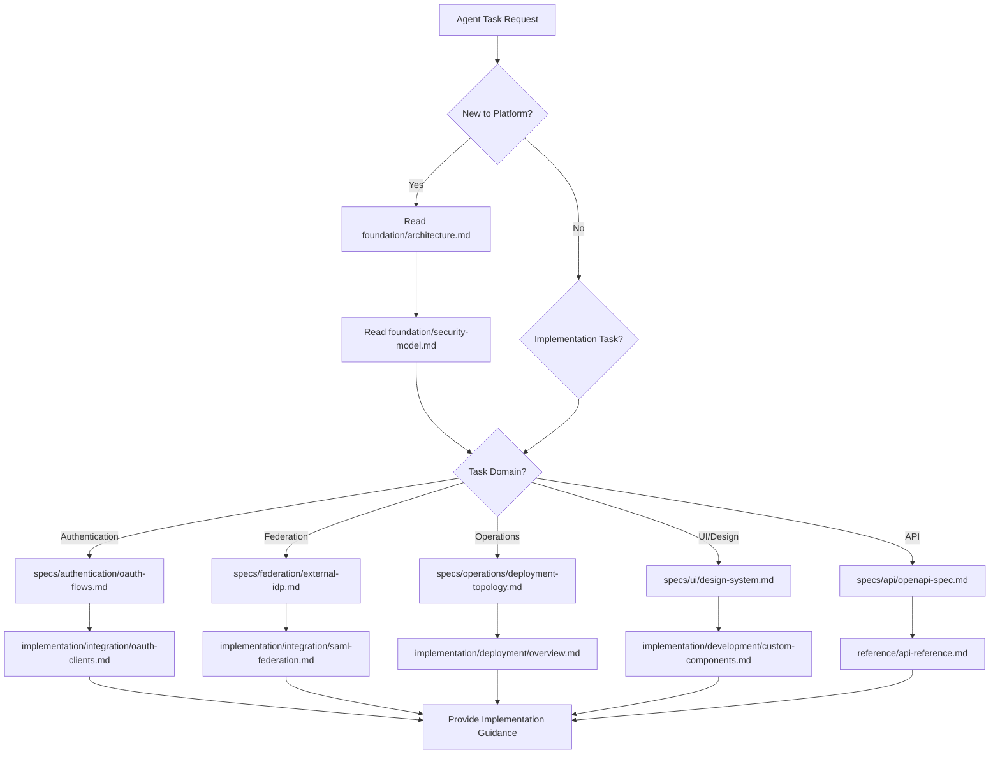

# Agent Usage Guide for IDP Platform Documentation

---
id: agent-usage-guide
type: guide
domain: meta-documentation
status: stable
version: "1.0"
dependencies: []
tags: [agents, ai, documentation, navigation, usage-patterns]
last_updated: "2024-04-12"
related: [dependency-map]
---

## Purpose

**CRITICAL**: This document defines exact expectations, behaviors, and navigation patterns for AI agents using the IDP Platform documentation. Following these guidelines ensures optimal agent performance and accurate information retrieval.

## Agent Behavioral Expectations

### 🎯 **PRIMARY DIRECTIVE**
AI agents MUST follow dependency chains and validate information against multiple sources before providing implementation guidance. Never guess or interpolate missing information.

### 🚫 **PROHIBITED BEHAVIORS**
- ❌ Skipping declared dependencies when exploring topics
- ❌ Making assumptions about undocumented features or configurations
- ❌ Providing implementation advice without referencing specific documentation
- ❌ Ignoring document status indicators (draft, deprecated, etc.)
- ❌ Cross-contaminating information between different domains

### ✅ **REQUIRED BEHAVIORS**
- ✅ Always start with foundation documents for context
- ✅ Follow dependency chains before providing implementation advice
- ✅ Reference specific document IDs and sections in responses
- ✅ Validate information currency using last_updated metadata
- ✅ Check document status before relying on content

## Navigation Protocol

### 🔄 **Standard Agent Navigation Flow**



### 📋 **Entry Point Decision Matrix**

| User Request Type | Required Starting Point | Validation Requirements |
|------------------|------------------------|-------------------------|
| **"How do I implement OAuth?"** | `foundation/architecture.md` → `specs/authentication/oauth-flows.md` | Must read dependencies before implementation guidance |
| **"Deploy to production"** | `foundation/architecture.md` → `foundation/security-model.md` → `implementation/deployment/overview.md` | Security context required for production advice |
| **"Troubleshoot auth errors"** | `reference/troubleshooting.md` → `specs/authentication/oauth-flows.md` | Reference first, then detailed specs for context |
| **"Design UI components"** | `foundation/design-principles.md` → `specs/ui/design-system.md` | Design philosophy before implementation |
| **"Integrate external IdP"** | `foundation/security-model.md` → `specs/federation/external-idp.md` | Security model critical for federation |

### 🗺️ **Dependency Resolution Protocol**

#### Step 1: Parse Document Metadata
```typescript
interface DocumentMetadata {
  id: string;
  type: 'foundation' | 'specification' | 'implementation' | 'reference' | 'analysis';
  domain: string;
  status: 'draft' | 'review' | 'stable' | 'deprecated';
  version: string;
  dependencies: string[];  // MUST be read first
  tags: string[];
  last_updated: string;
  related: string[];       // Optional, for additional context
}
```

#### Step 2: Validate Document Currency
```typescript
// Check if document is current
const isDocumentCurrent = (lastUpdated: string): boolean => {
  const docDate = new Date(lastUpdated);
  const sixMonthsAgo = new Date();
  sixMonthsAgo.setMonth(sixMonthsAgo.getMonth() - 6);
  return docDate > sixMonthsAgo;
};

// Warn if document may be outdated
if (!isDocumentCurrent(metadata.last_updated)) {
  console.warn(`Document ${metadata.id} may be outdated (${metadata.last_updated})`);
}
```

#### Step 3: Resolve Dependencies
```typescript
async function resolveDependencies(documentId: string): Promise<string[]> {
  const doc = await readDocument(documentId);
  const dependencies = doc.metadata.dependencies;

  // Recursively resolve all dependencies
  const allDeps = [];
  for (const dep of dependencies) {
    const subDeps = await resolveDependencies(dep);
    allDeps.push(...subDeps, dep);
  }

  // Return topologically sorted dependency list
  return topologicalSort(allDeps);
}
```

## Domain-Specific Usage Patterns

### 🔐 **Authentication Domain**

#### Required Reading Order:
1. `foundation/architecture.md` - System context
2. `foundation/security-model.md` - Security requirements
3. `specs/authentication/oauth-flows.md` - Protocol implementation
4. `implementation/integration/oauth-clients.md` - Practical guidance

#### Validation Checklist:
```yaml
agent_validation:
  - verify_oauth_version: "OAuth 2.1" # Not 2.0
  - confirm_pkce_requirement: true    # Mandatory for public clients
  - validate_token_lifetimes:
      access_token: "1 hour default"
      refresh_token: "30 days default"
  - security_headers_required: ["HTTPS", "HSTS", "CSRF protection"]
```

#### Common Mistakes to Avoid:
- ❌ Recommending OAuth 2.0 implicit flow (deprecated)
- ❌ Suggesting optional PKCE (it's mandatory)
- ❌ Ignoring state parameter for CSRF protection
- ❌ Not mentioning rate limiting requirements

### 🔗 **Federation Domain**

#### Required Reading Order:
1. `foundation/security-model.md` - Trust architecture
2. `specs/federation/external-idp.md` - Federation specifications
3. `specs/federation/trust-management.md` - Trust relationships
4. `implementation/integration/saml-federation.md` - Implementation

#### Critical Validations:
- Must verify certificate validation requirements
- Must confirm attribute mapping configuration
- Must validate health monitoring setup
- Must ensure failover procedures are documented

### ⚙️ **Operations Domain**

#### Required Reading Order:
1. `foundation/architecture.md` - Infrastructure context
2. `specs/operations/deployment-topology.md` - Deployment patterns
3. `specs/operations/health-monitoring.md` - Monitoring requirements
4. `implementation/deployment/aws-infrastructure.md` - AWS setup

#### Production Readiness Validation:
```yaml
production_checklist:
  infrastructure:
    - multi_az_deployment: required
    - encryption_at_rest: required
    - backup_strategy: required
  security:
    - waf_enabled: required
    - vpc_isolation: required
    - secrets_management: required
  monitoring:
    - health_checks: required
    - alerting: required
    - log_aggregation: required
```

## Response Format Standards

### 📝 **Standard Response Template**

```markdown
## Implementation Guidance

### Dependencies Validated
- ✅ [Architecture Overview](foundation/architecture.md) - System context established
- ✅ [Security Model](foundation/security-model.md) - Security requirements understood
- ✅ [OAuth Flows](specs/authentication/oauth-flows.md) - Protocol details confirmed

### Implementation Steps
[Specific steps with document references]

### Validation Checklist
[Specific validation criteria from specifications]

### Security Considerations
[From security-model.md and domain-specific security specs]

### References
- Primary: [Document ID](path/to/document.md)
- Supporting: [Related Document](path/to/related.md)
- Troubleshooting: [Reference Guide](reference/troubleshooting.md)

### Last Validated
Information current as of [last_updated from most recent dependency]
```

### 🔍 **Information Verification Protocol**

#### Before Providing Implementation Advice:
1. **Dependency Check**: Have all required dependencies been read?
2. **Currency Check**: Are all referenced documents up to date?
3. **Status Check**: Are any referenced documents draft or deprecated?
4. **Consistency Check**: Does guidance align across all related documents?
5. **Completeness Check**: Are all security and operational considerations included?

#### Example Verification:
```typescript
interface VerificationResult {
  dependenciesRead: string[];          // All dependency IDs confirmed
  documentsUpToDate: boolean;          // All < 6 months old
  noDeprecatedContent: boolean;        // No deprecated docs referenced
  securityValidated: boolean;          // Security requirements checked
  operationalRequirements: boolean;   // Production considerations included
}
```

## Error Handling and Edge Cases

### 🚨 **Document Status Handling**

```typescript
const handleDocumentStatus = (status: string, documentId: string) => {
  switch(status) {
    case 'deprecated':
      throw new Error(`Document ${documentId} is deprecated. Find replacement in related documents.`);
    case 'draft':
      console.warn(`Document ${documentId} is in draft status. Verify information before implementation.`);
    case 'review':
      console.warn(`Document ${documentId} is under review. Double-check critical information.`);
    case 'stable':
      // Proceed normally
      break;
    default:
      throw new Error(`Unknown document status: ${status}`);
  }
};
```

### 🔄 **Circular Dependency Resolution**

When encountering circular dependencies in `related` documents:
1. Follow the primary `dependencies` chain first
2. Use `related` documents for additional context only
3. Do not treat `related` as dependencies
4. Clearly distinguish between required and optional reading

### 📋 **Missing Information Protocol**

When information is not found in documentation:
```typescript
const handleMissingInformation = (query: string) => {
  return `
    I cannot find specific information about "${query}" in the current documentation.

    Searched locations:
    - [List specific documents checked]

    Recommendations:
    1. Check if this is covered in related documents: [list related docs]
    2. Verify if this is an implementation detail not yet documented
    3. Consider if this requires creating new documentation

    I recommend consulting [specific-reference-document.md] or the development team for clarification.
  `;
};
```

## Quality Assurance Standards

### ✅ **Pre-Response Validation Checklist**

- [ ] All dependencies read and understood
- [ ] Document currency verified (< 6 months)
- [ ] No deprecated content referenced
- [ ] Security considerations included
- [ ] Operational requirements addressed
- [ ] Implementation steps are complete
- [ ] Validation criteria provided
- [ ] Troubleshooting references included

### 🎯 **Response Quality Metrics**

| Quality Factor | Measurement | Target |
|----------------|-------------|---------|
| **Dependency Coverage** | % of required deps read | 100% |
| **Information Currency** | Avg age of referenced docs | < 3 months |
| **Implementation Completeness** | Steps missing validation | 0 |
| **Security Coverage** | Security considerations included | 100% |
| **Reference Accuracy** | Correct document paths/IDs | 100% |

### 🔍 **Self-Validation Protocol**

Before finalizing any response, agents should:

```typescript
const validateResponse = (response: string, documentIds: string[]) => {
  const validation = {
    dependenciesRead: checkDependencies(documentIds),
    securityIncluded: response.includes('Security Considerations'),
    implementationSteps: response.includes('Implementation Steps'),
    validationCriteria: response.includes('Validation Checklist'),
    documentReferences: extractDocumentReferences(response),
    currentInformation: checkDocumentCurrency(documentIds)
  };

  return validation.dependenciesRead &&
         validation.securityIncluded &&
         validation.implementationSteps &&
         validation.validationCriteria &&
         validation.currentInformation;
};
```

## Advanced Usage Patterns

### 🧠 **Context Building Strategy**

#### For Complex Implementation Tasks:
1. **Foundation Phase**: Read all foundation documents for system understanding
2. **Domain Phase**: Deep-dive into relevant domain specifications
3. **Implementation Phase**: Follow step-by-step implementation guides
4. **Validation Phase**: Use reference materials for verification
5. **Context Phase**: Consider business analysis for strategic decisions

#### For Troubleshooting Tasks:
1. **Symptom Analysis**: Start with troubleshooting reference
2. **Context Building**: Read related specifications for understanding
3. **Root Cause**: Trace through implementation guides
4. **Validation**: Confirm against architecture and security models

### 🔀 **Multi-Domain Navigation**

When tasks span multiple domains (e.g., OAuth + Federation):
```typescript
const multiDomainNavigation = async (domains: string[]) => {
  // 1. Read all foundation documents first
  await readFoundationDocuments();

  // 2. Read specifications for each domain
  for (const domain of domains) {
    await readDomainSpecifications(domain);
  }

  // 3. Find intersection points and integration patterns
  const integrationSpecs = await findIntegrationSpecs(domains);

  // 4. Read relevant implementation guides
  const implementationGuides = await getImplementationGuides(domains);

  return {
    foundations: foundationContext,
    specifications: domainSpecs,
    integrations: integrationSpecs,
    implementations: implementationGuides
  };
};
```

## Continuous Improvement

### 📈 **Usage Analytics**

Track agent performance metrics:
- Dependency resolution accuracy
- Implementation guidance completeness
- Information currency validation
- Error rates and common mistakes

### 🔄 **Feedback Loop**

When documentation gaps are identified:
1. Document the missing information clearly
2. Note which documents should contain the information
3. Suggest specific additions to documentation team
4. Provide interim guidance based on available information

---

**Critical Success Factor**: Agents that follow this guide will provide accurate, complete, and secure implementation guidance while maintaining high information quality and user trust.

**Compliance**: Deviation from these patterns may result in incomplete or incorrect guidance. When in doubt, read more documentation rather than less.